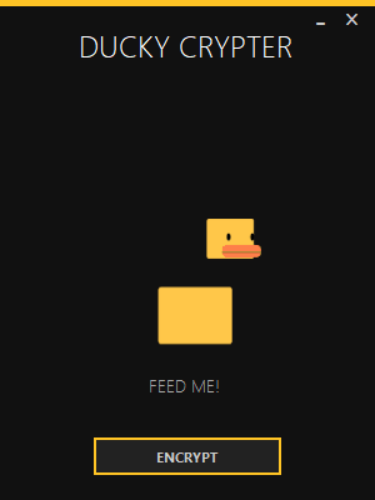

### Welcome to Pacman Crypter tool version 1.0

This tool will obfuscate EXE file it's very simple to use.

### ❗ What is this ?

Ducky is a crypter tool that automate procedures during obfuscation and make's your payload fully undetectable and persistent. It works with All RAT's. This tool was made for Windows users.

Video Proof: https://youtu.be/8hT4MGm9uUU

### ⚙️ FEATURES

- Obfuscate payload fully undetectable
- Undetectable ScanTime of 2/40 Antivirus
- Obfuscate & Powerfull persistent.
- Compatible with All RAT's
- Easy to use & it doesn't need knowledge

### 📖 HOW TO INSTALL
IMPORTANT! install latest version of python
1. Donwload & install python3 ('https://www.python.org/downloads/')
2. Build your payload with the Remote Administrative tool that you are using
3. Download the tool ('')
4. Unzip the file
5. Open the DUCKY.exe file
6. Make sure that your python3 path is added to Environment Variables
7. Drag & Drop your payload into the tool
8. press ENCRYPT button

To learn more please watch this video: https://youtu.be/8hT4MGm9uUU

### 📡 HOW TO UPDATE

You can check updates from our official website:
https://ctoslab.com/products/

For feature recommendation please add it on the "Issues" tab or contact us:
https://www.ctoslab.com/support/

### 💡 Bonus Useful Tricks! (For Beginners)

Add Encrypted payload from the beginning to Bypass RunTime.

### 💰 Donate

If you like my work, consider buying me a coffee :)

Bitcoin > 17qcsGD3FTckSqHLH4PE4XfRtcktgAZTJm

⚠️ We are not responsible on how you use this tool. 
